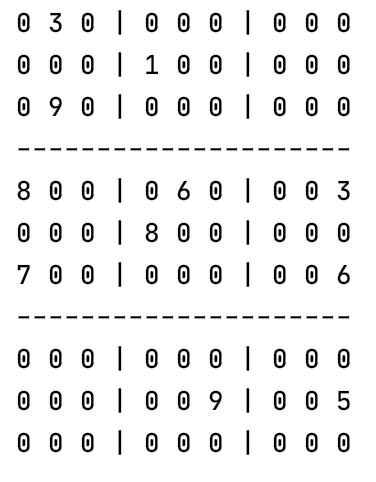
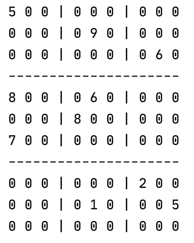

# SUDOKU

### Zitong Wu, Oct. 27, 2020

   
Models and solves a sudoku puzzle as as a propositional logic satisfiability problem.     

Rule: the same single integer do not appear twice in the same row, column, diagonal, or any of the nine 9×9 playing board.

## Instructions
* In the terminal, navigate to the folder where the files are, type for example: `python3 solve_sudoku.py puzzle1.cnf`. Change the argument `puzzle1.cnf` with the sufoku cnf file you want to test.

* Alternatively, in "test_sat.py", type the sudoku cnf filename. For example: `filename = "puzzle1.cnf"`

## Examples
Puzzle 1 solution:

  

Puzzle 2 solution:

  

